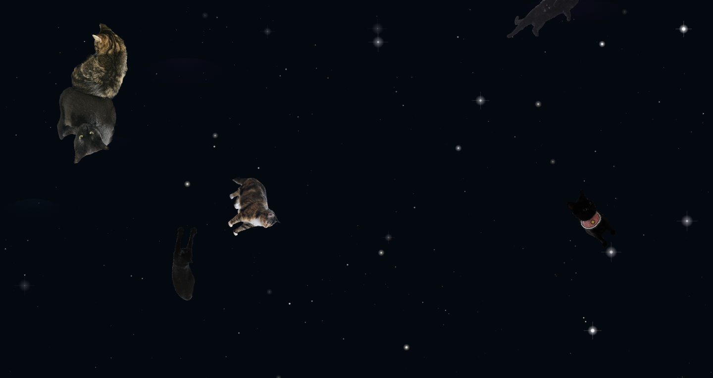

# 🐱 catspace
I was bored, didn't want to study, and missed my cats, so I made this as a little stress reliever.
You know how some people stare at a fireplace or the ocean to zone out and decompress? This is that, but with cats floating through space.

### Link 
[ → Open Catspace](https://jahabe.github.io/catspace/)

### Built with
* HTML Canvas API: stars, parallax, and animation loop
* Device Orientation API: tilt your phone, and the stars follow
* Vanilla JS: no frameworks, no libraries
* Claude: for pair programming and iteration
